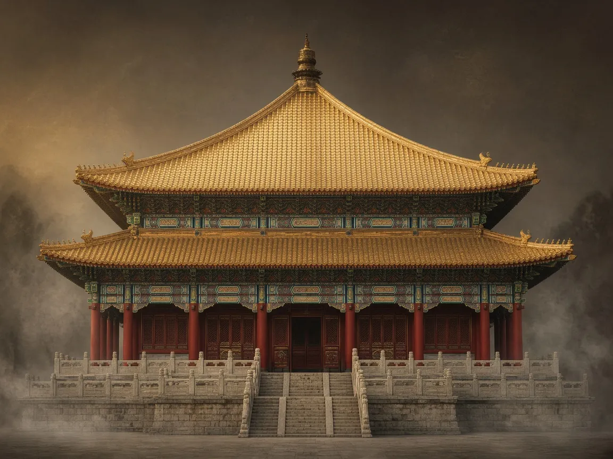

# 中国古建筑 · 三维拆解科普

## 万法归一殿

- **时代 / 类型**：殿堂木构 · 藏传金顶殿宇
- **简介**：万法归一殿是清承德普陀宗乘之庙的主殿意象：汉藏交融的木构殿堂，重檐攒尖、金瓦耀日，曾是清帝与各族首领礼佛集会之处。

- **详解**：原型位于河北承德避暑山庄北侧的普陀宗乘之庙（俗称「小布达拉宫」），建于乾隆三十五年（1770 年）。殿平面近方形，重檐四角攒尖顶，上覆鎏金鱼鳞铜瓦与法铃宝顶，金光在群楼环抱中尤为夺目。大木架以柱网承托梁枋、斗栱与屋面，下有台基，中设殿身与腰檐层次，体现官式营造与藏传佛殿装饰的结合。乾隆三十六年，乾隆帝曾在此接见东归的土尔扈特部首领渥巴锡，并举行讲经祝寿，殿因此也承载着清代民族交往与国家礼仪的记忆。本页三维模型便于对照：拖动滑杆可按台基、殿身、腰檐、斗拱、屋面五层爆炸拆解；点击左侧模块，阅读对应营造知识。

爆炸视图自下而上依次为 **台基 → 殿身 → 腰檐 → 斗栱 → 屋面**；越靠下的层承重越重、越偏结构，越靠上的层越具识别度、越偏形象。

---

## 五层拆解

### L5 屋面层

> 屋顶与脊饰

#### 屋面

- **要点**：屋面覆盖与曲线轮廓
- **简介**：屋面不止遮风挡雨——那一条飞檐曲线，正是中国建筑最有辨识度的天际线。
- **详解**：官式殿宇以筒瓦、板瓦覆顶，屋脊分正脊、垂脊、戗脊。檐角微微上翘，让檐口化作柔和曲线：既加速排水，也成就《诗经》里「如鸟斯革，如翚斯飞」的轻盈意象。再看屋顶形式——庑殿、歇山、悬山、硬山，等级依次递减，是分辨古建类型的第一把钥匙。

#### 金饰屋脊

- **要点**：鎏金与屋脊装饰
- **简介**：屋脊、宝顶与檐口的金色饰件，既是宗教象征，也是整座殿宇的视觉焦点。
- **详解**：藏传佛教与皇家殿宇常见鎏金铜瓦、宝瓶、法轮等饰件。金色在阳光下格外耀眼，远望即成一殿之眼。这座殿取名「金殿」，正因屋面与脊饰大量鎏金——用最夺目的材料，宣示神圣与尊贵。

---

### L4 斗拱层

> 铺作 · 梁架 · 天花

#### 梁架

- **要点**：大木作横梁与枋木
- **简介**：梁与枋把柱网连成整体，把屋顶的重量层层卸到柱脚，是「大木作」的核心。
- **详解**：梁承受上部重量，枋横向拉结柱身、稳定平面，同属大木作。北方殿堂多用抬梁式：梁上立短柱，再承上一层梁，逐层收进直至脊檩。看懂这一层层梁架，就基本看懂了古建怎么「把屋顶稳稳托起来」。

#### 斗栱与屋架

- **要点**：檐下铺作与屋顶木构
- **简介**：斗栱（铺作）是柱头与屋檐之间的过渡构件，既挑出屋檐承重，也是时代与等级的活化石。
- **详解**：斗是方形垫块，栱是弓形短木，一层层叠出即为铺作。唐宋斗栱雄大疏朗，明清趋于繁密精巧。再往上，椽、望板、檩条等屋架层层铺开，与斗栱共同完成「柱 → 斗栱 → 屋面」的传力链。看斗栱的尺度与疏密，就能估出这座殿的年代气质。

#### 天花藻井

- **要点**：室内顶棚与祥瑞纹饰
- **简介**：天花与藻井装点殿内上空，遮住梁架之余，更以龙纹、星象营造一方神圣天地。
- **详解**：藻井是向上凹进的天花，专用于殿内最尊贵的位置上方；龙纹、星宿纹等强化宗教或皇权象征。这座殿里的龙纹顶饰与星象构件提醒我们：古建从不只「看外面」——室内装饰与室外屋面一样讲究，里外是一体的完整艺术品。

---

### L3 腰檐层

> 下层檐口与承托

#### 腰檐

- **要点**：上下层之间的檐口
- **简介**：重檐殿宇在上下层之间设腰檐，既护住下层墙身，也把立面分出丰富的层次。
- **详解**：多檐建筑自下而上层层出檐。腰檐悬在主屋面之下，让立面形成「层叠如云」的节奏，同时为下层遮雨。拆解时把它单独分成一层，正好帮我们对照「台基 → 殿身 → 腰檐 → 斗栱 → 屋面」这条竖向构成。

---

### L2 殿身层

> 柱网 · 门墙 · 彩饰

#### 柱网

- **要点**：立柱与柱身装饰
- **简介**：柱是木构架的竖向承重骨干，按面阔、进深排成柱网，也决定了每个开间的尺度。
- **详解**：中国古建以「柱网」组织平面：面阔几间、进深几间，皆由此定。檐柱挑檐，金柱承梁架；柱身可圆可方，常施油漆彩绘，柱头上再架枋、斗栱。这座殿里的一根根立柱与柱身饰件，正是整座殿宇「立起来」的骨架——先有柱子，才有屋顶。

#### 门框

- **要点**：入口与门屋构架
- **简介**：门是室内外的礼仪节点，门框、门槛与门扇的尺度，往往暗合开间与等级制度。
- **详解**：殿宇正门多居明间，门框由门楣、抱框、门槛组成。朱红大门、铺首门环、门钉数量，在礼制建筑里都有讲究。入口不只是交通口，更是轴线序列上「由外入内」的仪式节点——推开门的瞬间，仪式才算开始。

#### 墙体

- **要点**：围护与分隔空间
- **简介**：墙在木构体系里主要负责围护——保温、防风、划分内外，而不是主要承重骨架。
- **详解**：抬梁、穿斗体系中，屋顶靠柱梁自承，墙体多属「填充」：外墙、山墙、隔墙用砖、土坯或木板。墙身可开窗、挂匾、施彩绘。明白「墙不承重」这一条，就抓住了中国木构与西方砌体建筑最根本的分野。

#### 彩绘与红金饰

- **要点**：朱红、贴金的建筑彩饰
- **简介**：油漆与彩画不只是防腐，更用色彩和纹样诉说等级、寓意与时代风格。
- **详解**：官式建筑常见红墙黄瓦，梁枋施和玺彩画或旋子彩画；龙纹、卷草等高规格纹样常以贴金呈现。朱红与金色对比强烈，让结构层次在远处依旧清晰可读。读彩绘的部位与配色，就能读出这座殿的礼仪等级与装饰语言。

#### 室内造像

- **要点**：殿内主尊与供奉空间
- **简介**：殿的核心，是室内空间与供奉对象——造像与佛坛，决定了朝拜的轴线与动线。
- **详解**：万法归一殿这类宗教殿堂，室内设主尊与胁侍；开间、尺度与采光，都围绕「瞻仰主尊」来组织。拆解时把造像单独分出，正是要提醒：建筑是容器，信仰才是中心。

#### 细部构件

- **要点**：门窗隔扇与附属装修
- **简介**：大木骨架之外，还有大量装修细部——隔扇、挂落、角饰，丰富着近人尺度的观感。
- **详解**：小木作包括门窗、隔断、天花线脚等，不承屋架荷载，却决定你走近它时的感受与使用方式。拆解视图中未归入明确大类的网格都收进本组，便于对照「大木承结构、小木定体验」的层次关系。

---

### L1 台基层

> 基座与踏跺

#### 台基

- **要点**：承托整座殿宇的基座
- **简介**：台基是古建自下而上的第一层，以砖石或夯土抬高地面，既防潮排水，也象征礼制等级。
- **详解**：殿宇多建于台基之上，台基越高、层数越多，等级越高。台面以条砖铺砌，周边常设阶条石；木地栿或木板构成室内地面。参观时先看台基高度与踏跺数量，就能大致判断这座殿的礼制地位——地基，就是古建写给礼制的第一句话。
